# Machine Learning Algorithms

CS2601-IA UTEC 2022-1

# **ÍNDICE**

- [Regresión](#Regresión)
    - [Regresión lineal univariable](##Regresion-lineal-univariable)
    - [Regresión lineal multivariable](##Regresion-lineal-multivariable)
    - [Regresión no lineal univariable](##Regresion-no-lineal-univariable)
    - [Regresión logística](#Regresion-logistica)
- [Clasificación](#Clasificación)
    - [Support vector machine](##Support-vector-machine)
    - [KNN](##KNN)
    - [Decision Trees](##Decision-Trees)
- [Clustering](#Clustering)
    - [K Means](##K-Means)
    - [Gaussian mixture model](##Gaussian-mixture-model)

# **Regresión**

## **Regresion lineal univariable**
- Intento de modelar relación entre variables ajustando una ecuación lineal a la data observada.

    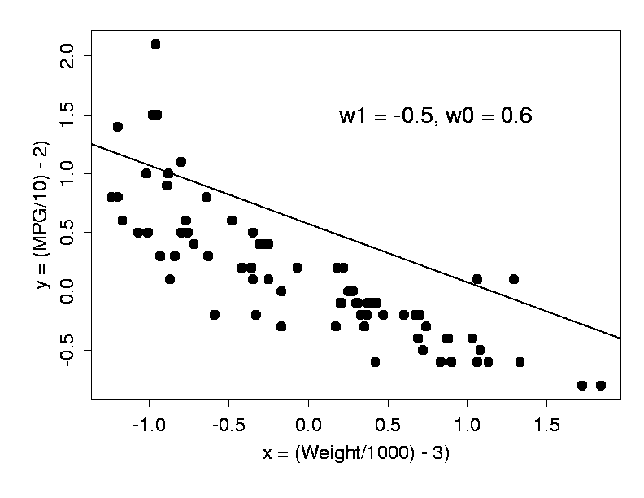

### **Hypothesis**

$$h(x_i) = x_i*w + b$$

A machine learning [`hypothesis`](https://machinelearningmastery.com/what-is-a-hypothesis-in-machine-learning/) is a candidate model that approximates a target function for mapping inputs to outputs. 

### **Loss function**

**MSE / Quadratic Loss / L2 Loss**

$$L(x_i) = Error = \frac{1}{2m}\sum_{i=0}^m (y_i - h(x_i)) ²$$

### **Gradient descent**

Gradient descent is an optimization algorithm used to minimize some function by iteratively moving in the direction of steepest descent as defined by the negative of the gradient.

$$db = \frac{1}{m}\sum_{i=0}^m(y_i - h(x_i))(-1)$$

$$dw = \frac{1}{m}\sum_{i=0}^m(y_i - h(x_i))(-x_i)$$

**Change parameter**

$$w_i = w_i - \alpha * \frac{\partial{\text{ Loss}}}{\partial{w_i}}$$

## **Regresion lineal multivariable**
- Generalización de la regresión lineal para el caso donde existe más de una variable independiente.

    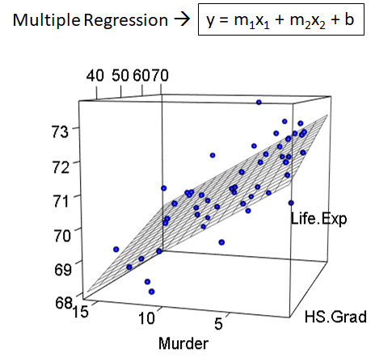

### **Hypothesis**
For $n$ features:

$$h(x^{(i)}) = w_0*x^{(i)}_0 + w_1 * x^{(i)}_1 + w_2 * x^{(i)}_2 + w_n * x^{(i)}_n$$

Where:

$$x_0 = \text{implicit } 1$$

And exists $n + 1$ variables to predict. Then:

Viewing at it as arrays where each row of matrix $x$ is a training example and exists $j$ training examples, we have:

$$
x = 
\begin{bmatrix} 
1 & x_{1,1} & ... & x_{1,n} \\
1 & x_{2,1} & ... & x_{2,n} \\
1 & ... & ... & ... \\
1 & x_{j,1} & ... & x_{j,n}
\end{bmatrix}_{j*(n+1)}
$$ 

And $x^{(j)}_{n}$ represents "the j-th value of the n-th feature" or "the n-th feature of the j-th training example". In addition:

$$w = \begin{bmatrix} w_0 & w_1 & ... & w_n \end{bmatrix}_{1*(n+1)}$$

$$
y = \begin{bmatrix} y_1 & y_2 & ... & y_j \end{bmatrix}_{1*j}
$$

Thus:

$$h(x_j) = x_j * w^t$$

$$
h(x_j) = 
\begin{bmatrix} 1 & x_{j,1} & ... & x_{j,n}\end{bmatrix}_{1*(n+1)} *
\begin{bmatrix} w_0 \\ w_1 \\ ... \\ w_n \end{bmatrix}_{(n+1)*1} 
= \text{model prediction}
$$

### **Loss function**

- Mean Squared Loss(MSE)
- Mean Absolute Loss(MAE)
- Huber Loss(MSE + MAE)

### **Gradient descent**

$$\frac{\partial{L}}{\partial{w_0}} = \frac{1}{m}\sum_{i=0}^m(y_i - h(x^i))(-1)$$

$$\frac{\partial{L}}{\partial{w_{j\neq 0}}} = \frac{1}{m}\sum_{i=0}^m(y_i - h(x^i))(-x^{i}_{j})$$

Donde $m$ ees el número de muestras de entrenamiento.

## **Regresion no lineal univariable**
- Regresión en el que la data observada se modela mediante combinación no lineal de los parámetros del modelo.

    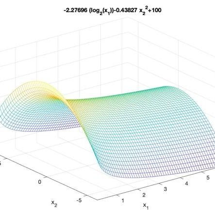

- Polinomios de grado muy alto provocan overfitting
    - Solución: Añadir regularizador (L1 L2)

### **Hypothesis**

$$h(x) = w_0*(x)^0 + w_1 * (x)^1 + w_2 * (x)^2 + ... + w_p * (x)^p$$
$$h(x) = [x^0, x^1, x^2, ..., x^p].[w_0, w_1, w_2, ..., w_p]^t$$

### **Loss function**

- MSE

### **Gradient descent**

$$\frac{\partial{L}}{\partial{w_0}} = \frac{1}{m}\sum_{i=0}^m(y_i - h(x_i))(-1)$$

$$\frac{\partial{L}}{\partial{w_{j\neq 0}}} = \frac{1}{m}\sum_{i=0}^m(y_i - h(x_i))(-x_j^{(i)})$$

## **Regresion logística**
- Método de clasificación que modela la probabilidad de un resultado discreto dado un input.
- Modela generalmente resultados binarios (T/F)
- Intenta encontrar una recta que separe bien 2 grupos

    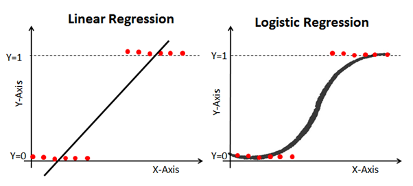

### **Hypothesis**

- Se puede notar que para los 3 anteriores tipos de regresión descritos, su función de error es la misma, lo único que varía es la hipótesis

Para $n$ características:

- Ecuación de la recta o hiperplano

$$h(x^{(i)}) = w_0*1 + w_1 * x^{(i)}_1 + w_2 * x^{(i)}_2 + w_n * x^{(i)}_n$$
$$h(x^{(i)}) = <x^{(i)}, w> = x^{(i)} . w^T$$ 

- Ecuación de la función sigmoidea (clasificador binario)

$$s(x^{(i)}) = \frac{1}{1 - \epsilon^{h(x^{(i)})}} = \frac{1}{1 - \epsilon^{x^{(i)} . w^T}}$$

$s(x_i)$ verifica que tan bien el hiperplano divisorio $h(x_i)$ separa ambos grupos y lo optimiza aplicando gradiente descendiente en su función de error.

### **Loss function**

**Cross-Entropy**

$$L = -\frac{1}{n}\sum_{i=0}^n(y_ilog(s(x_i)) + (1-y_i)log(1-s(x_i)))$$

$$L(x) = \text{Error} = \frac{-1}{m} \sum_{i=0}^m ( y^{(i)} . \log(s(x^{(i)})) + (1 - y^{(i)}) . \log(1 - s(x^{(i)})))$$

Donde:

$y^{(i)} . \log(s(x^{(i)}))$ mide el error cuando $y_i = 1$

$(1 - y^{(i)}) . \log(1 - s(x^{(i)}))$ mide el error cuando $y_i = 0$

### **Gradient descent**

$$ \frac{\partial{L}}{\partial{w_0}} = \frac{1}{m}\sum_{i=0}^m(y_i - h(x^i))(-1) $$
$$ \frac{\partial{L}}{\partial{w_{j\neq 0}}} = \frac{1}{m}\sum_{i=0}^m(y_i - h(x^i))(-x^{i}_{j}) $$

$$w_i = w_i - \alpha * \frac{\partial{\text{ Loss}}}{\partial{w_i}}$$

# **Clasificacion**

## **Support vector machine**
- Método usado en regresión y clasificación.
- Algoritmo que trata de encontrar un buen hiperplano divisorio bajo ciertos límites de decisión.

    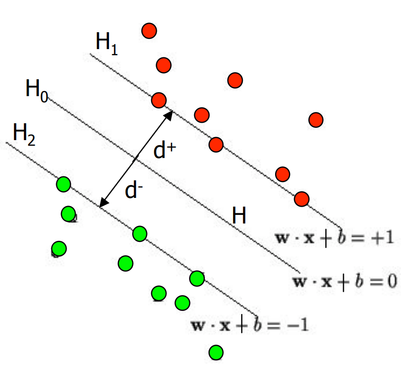

### **Hard SVM**

$$L = f(x,y) - \lambda g(x,y) = 0$$
$$L = \frac{1}{2} ||w||^2 - \sum_{i=1}^{n} \lambda_i (y_i (w.x_i + b) - 1)$$

### **Soft SVM**

$$
\begin{align*}
L &= \frac{1}{2} ||w||^2 - c \sum_{i=1}^{n} max(0, 1 - yi(x.w +b))\\ 
\end{align*}
$$

### **Margins**

Hard SVM                  |  Soft SVM
:-------------------------:|:-------------------------:
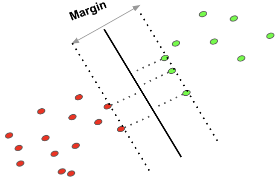   |  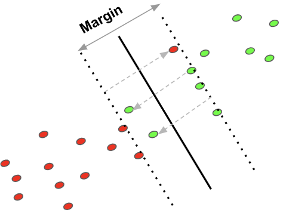

### **Multiclass SVM**

One to One                  |  One to Many
:-------------------------:|:-------------------------:
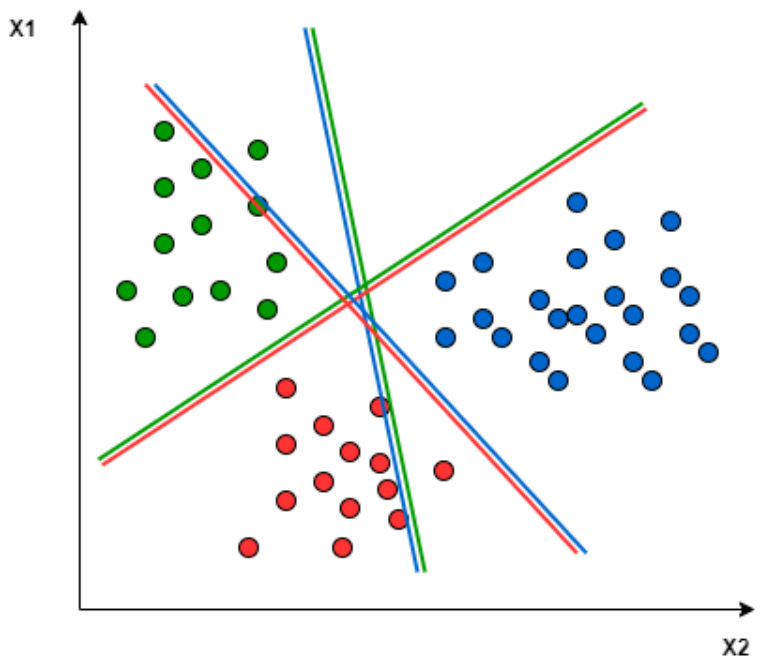   |  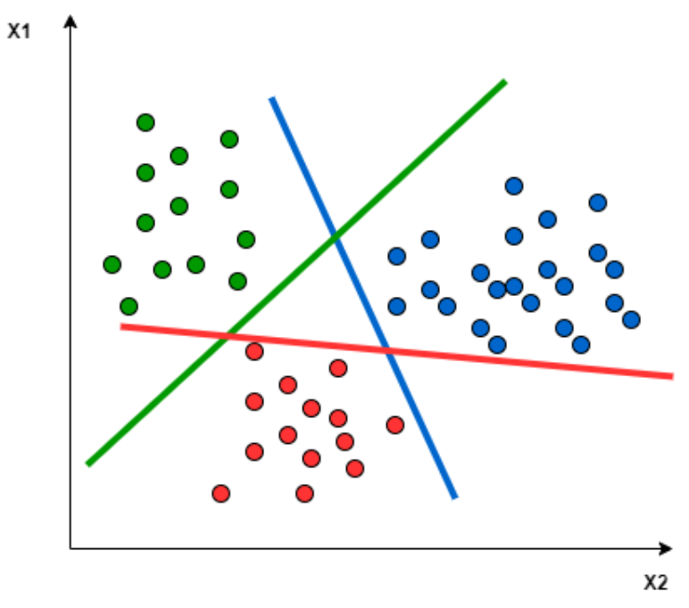

### **Kernels**

    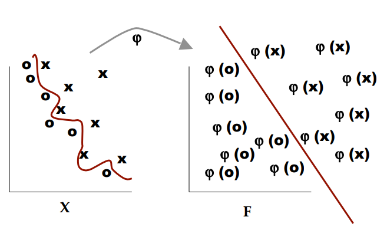

## **KNN**
- Método supervisado de clasificación, el cual usa la proximidad para realizar clasificaciones o predicciones sobres la agrupación de un punto de datos individual
- Puede ser usado también para regresión
- Lazy learning algorithm

    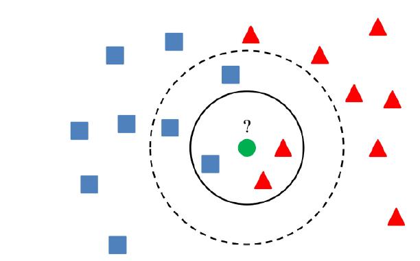

- Guarda la información de los vecinos en una estructura de datos eficiente: KD Tree, M Tree, R Tree, Slim Tree, teniendo en cuenta la similitud entre ellos
- Lee los K vecinos mas cercanos en unidades o en función de un R(radio)
- El problema es como setear el hiperparametro K y R
- Puede usarse para clasificación y regresión

**Voting**
Plurality vote (clasificación)
Majority vote

**Formalización**

## **Decision Trees**
- Modelo de predicción
- Los nodos terminales deben tener alta pureza

    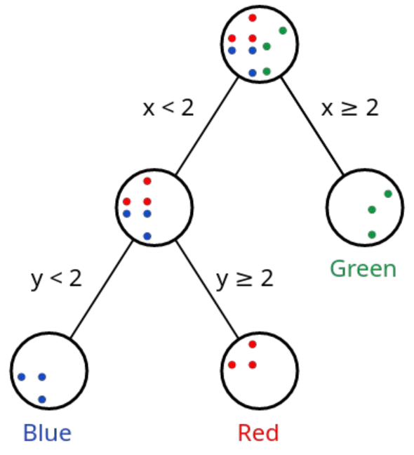

### **Ecuación de la información**

Cuando algo es muy probable que suceda no hay información, cuando algo es poco probable hay mucha información por descubrir/analizar.

$$I(x) = log(1/p(x)) = -log(p(x))$$

### **Entropía**

- Medida de impureza o aleatoriedad en los puntos de datos.

$$H(x) = E[I(x)] = \sum_{i=1}^n p(x_i) I(x_i) = -  \sum_{i=1}^n p(x_i) log(x_i)$$

### **Nivel de desorden de una clase**

$$D_s = - \sum_{c \in C} P_c log_2(P_c)$$

### **Information Gain**

- Cuantifica que caracteristica proporciona máxima información.
- `Gain = Caos no agrupado - Caos agrupado`
$$Gain(S) = D_s(S) - \sum_{f \in \text{Features}} \frac{|S_f|}{|S|} * D_s(S_f)$$

### **Gini Index**

- Calcula la cantidad de probabilidad de que una característica específica se clasifique incorrectamente cuando se selecciona al azar

$$Gini(x) = 1 - \sum_j^{\text{hijos}} [p(j|t)]^2$$

### **Gini Split**

$$Gini_{\text{split}} = \sum_{i=1}^k \frac{n_i}{n} Gini(i)$$

## **Bagging y Random forest**

- Bagging = Bootstrap Aggregating
- Entrenar muchos modelos de DT y por majority vote de los resultados determinar la clase a la que pertenece la data de test.
- Ensembling → ensamblar varios clasificadores entrenados y de acuerdo a la moda elegir el resultado

# **Clustering**

## **K Means**
- Método de clustering no supervisado que busca dividir la data en K grupos donde cada observación pertenece al grupo con valor medio más cercano

    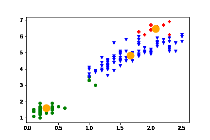

## **Gaussian mixture model**

# **Metricas**

## **Model selection**

Elección de hiperparámetros óptimos para el modelo.

Ejm:
- learning rate $\alpha$, treshold, epochs in Regression
- lambda $\lambda$ for Regularization L1 L2
- centroid radio in DBSCan and MeanShift

### **Learning rate**
- Determina cuan rápido se mueve el modelo

### **Bias**

### **Variance**

## **Loss function**

### **Mean Squared Error**

**MSE** is preferred to use when **there are low outliers in the data**. This is one of the drawbacks of MSE.

$$\text{MSE} = \frac{1}{2m} \sum_{i=1}^{m} (y^{(i)} - \overline{y}^{(i)})^2$$

### **Mean Absolute Error**

**MAE** is preferred to use **when there is a chance of having outliers in the data**. This is one of the Advantages of MAE. Using **standardized data is efficient** for better optimization using this loss.

$$\text{MAE} = \frac{1}{m} \sum_{i=1}^{m} \mid (y^{(i)} - \overline{y}^{(i)}) \mid$$

### **Huber Loss**

**Huber Loss** can be interpreted as a combination of the Mean squared loss function and Mean Absolute Error.

Huber loss brings the best of both MSE and MAE.

The δ term is a hyper-parameter for **Hinge Loss**.

$$
\text{Hubber Loss} =
\begin{cases} 
    \frac{1}{2} (y^{(i)} - \overline{y}^{(i)})^2,  & \text{if }  (y^{(i)} - \overline{y}^{(i)}) \leq \delta\\
    \delta (\mid (y^{(i)} - \overline{y}^{(i)}) \mid - \frac{1}{2} \delta) & \text{otherwise}
\end{cases}
$$

### **Hinge Loss**

$$L = max(0, 1 - y * f(x)) $$

### **Cross entropy Loss**

$$L = - y_i log(s(x_i)) - (1-y_i)log(1-s(x_i)) $$

## **Regularization**

The key difference between these techniques is that Lasso shrinks the less important feature’s coefficient to zero thus, removing some feature altogether. So, this works well for feature selection in case we have a huge number of features.

### **L1 Regularization: Lasso Regresssion**

**LASSO:** Least Absolute Shrinkage and Selection Operator

$$\lambda_i * \sum_{j=1}^{p} | w_j | $$

### **L2 Regularization: Ridge Regression**

$$\frac{\lambda}{n} * \sum_{j=1}^{p} (w_j)^2$$

L1 genera valores más cercanos a 0 que L2

## **Gradient descent optimization algorithms**

- **Batch gradient descent**

- **Stochastic gradient descent**

- **Mini-batch gradient descent**

## **Over/Under-fitting**

- Llegar al mínimo global de la función de error provoca un overfitting

### **Overfitting**
- Se asocia a problemas de generalización
- Modelos complejos se asocian a este problema
    - Solución: Disminuir la complejidad del polinomio bajando su grado

### **Underfitting**
- Modelos inexactos se asocian a este problema
    - Solución: Aumentar complejidad del modelo y cómputo

## **Data Normalization**

- Ajusta mejor las derivadas y evita que los cambios durante el descenso del gradiente no sean excesivos.
- Determina la perfección de la dirección en el descenso del gradiente

### **Min-Max Normalization**
This method rescales the range of the data to [0,1].

    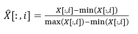

### **Z Normalization**

### **Unit Vector Normalization**

## **Validation and training in classification problems**

Sirve para estimar el ratio de error correcto.

### **Holdout**

    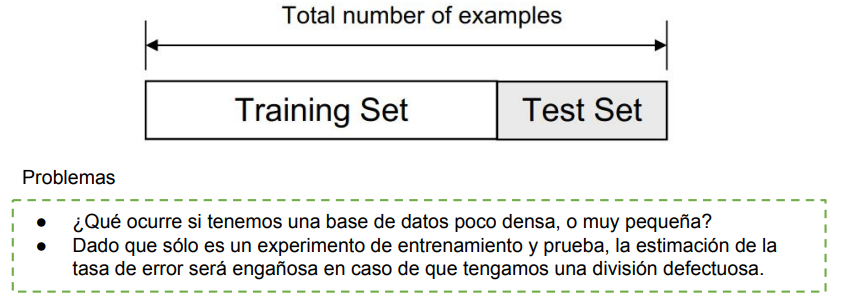

### **Resampling methods**

#### **Random subsampling**

    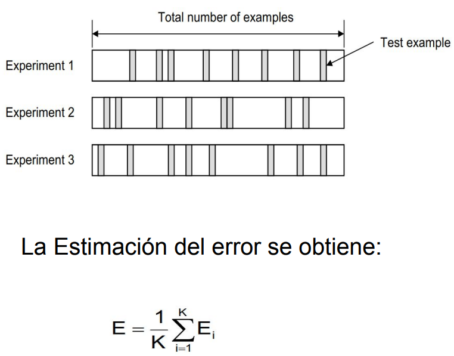

#### **K-Fold Cross-Validation**

    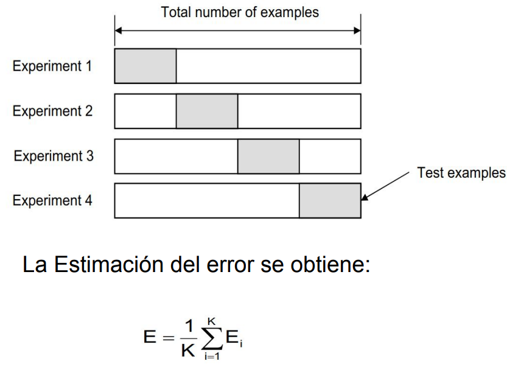

#### **Leave-one-out Validation**

    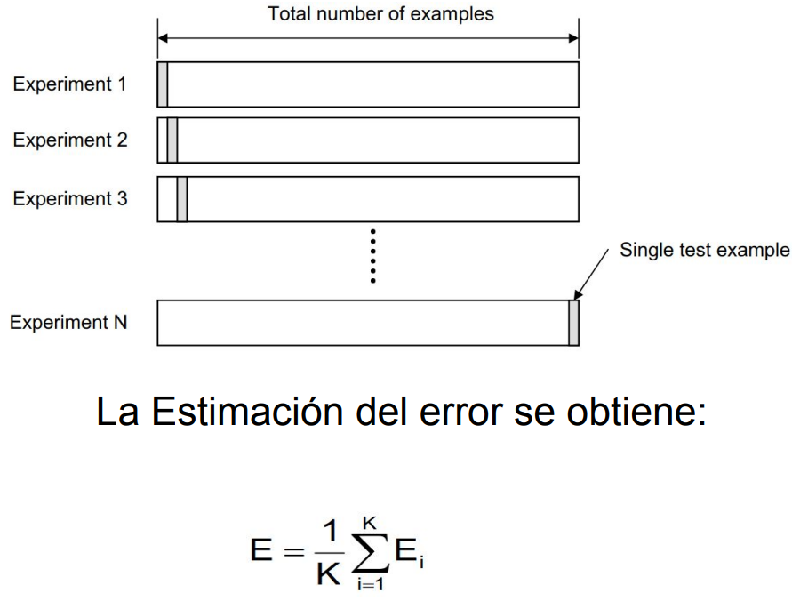

- Extremadamente pesado a nivel computacional para base de datos grandes
- Recomendado para bases de datos pequeñas

#### **Bootstrap**

    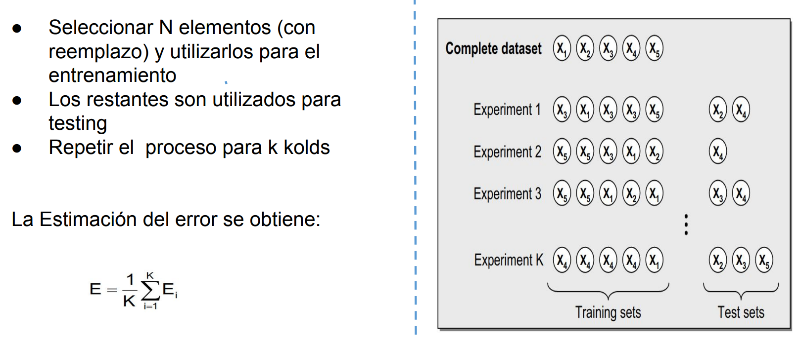

# **Articles**

- [Hypothesis in ML](https://machinelearningmastery.com/what-is-a-hypothesis-in-machine-learning/)
- [Common Loss functions](https://towardsdatascience.com/common-loss-functions-in-machine-learning-46af0ffc4d23)
- [7 loss functions](https://www.analyticsvidhya.com/blog/2019/08/detailed-guide-7-loss-functions-machine-learning-python-code/)
    - MSE, MAE, MBE, Hinge Loss, Cross Entropy Loss
- [MAE MSE Hubber Loss](https://datamonje.com/regression-loss-functions/)
- [Gradient Descent](https://ml-cheatsheet.readthedocs.io/en/latest/gradient_descent.html)
    - Learning rate, Cost function
- [Understanding learning rate](https://towardsdatascience.com/https-medium-com-dashingaditya-rakhecha-understanding-learning-rate-dd5da26bb6de)
- [Understanding data normalization](https://towardsdatascience.com/understand-data-normalization-in-machine-learning-8ff3062101f0)

# **References**

[SVM & PCA Tutorial from beginner](https://www.kaggle.com/code/faressayah/support-vector-machine-pca-tutorial-for-beginner)

[ML from scratch](https://github.com/marvinlanhenke/DataScience/tree/main/MachineLearningFromScratch)

[Multiclass SVM](https://gist.github.com/mblondel/97cffbea574a5890f0d7)

[ML-Collection](https://github.com/aladdinpersson/Machine-Learning-Collection/tree/master/ML/algorithms)
